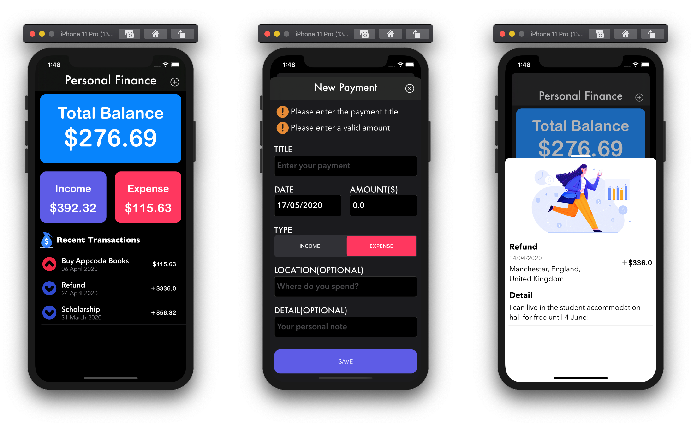

MoneyPlus
=====

An open-source app which can help you record income and expense.

This version is no longer maintained. I will take some time to develop a React-Native version.

[中文版说明](./README_ZH.md)

### 0 Introduction

It is my first little project since I began learning iOS development. After about one month's learning, finally I created an iOS app with integral functions. Certainly, currently the app is still very simple, but I will add more functions for it later.

### 1 Function

- [x] Add a record 
- [x] Delete a record
- [x] Display the detail of a record

### 2 Feature

- [x] Based on MVC(Massive View Controller?)
- [x] Core Data used
- [x] Support Dark Mode
- [x] Simple User Interface

### 3 Development Environment

- iOS >= 13.0
- Swift 5
- Xcode 11

### 4 TODO

- [ ] Edit records

- [ ] Add a statistical chart

- [ ] ...

### 5 Screenshot

